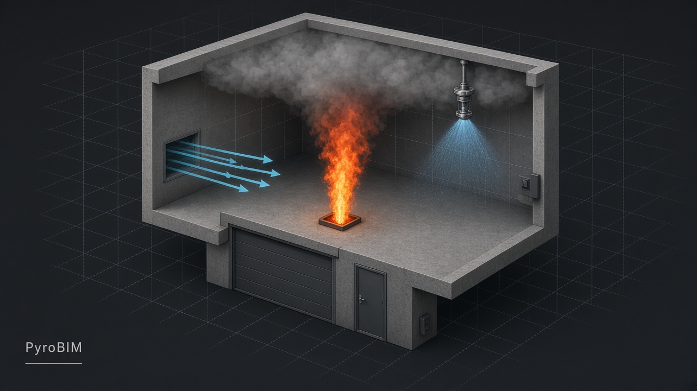
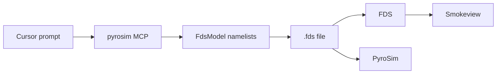
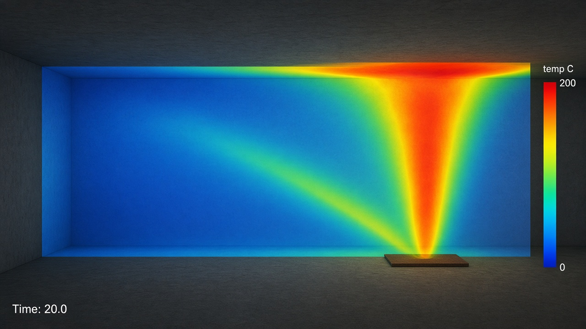

# PyroBIM

<p align="center">
  
</p>

Cursor MCP for **Thunderhead PyroSim / NIST FDS**. The agent writes and edits `.fds` namelist files — not GUI clicks — then can launch FDS, Smokeview, or PyroSim.



## Sample

Illustrative temperature slice of a compartment fire: floor burner, plume, and ceiling jet. The MCP writes the matching `&MESH`, `&REAC`, `&SURF`/`&OBST` fire, `&SLCF` (with `PBX`/`PBY`/`PBZ` or `XB`), sprinklers, and vents.

<p align="center">
  
</p>

Prompt to recreate the setup: *“Create a 5×5×3 m room and add a couch fire in the corner. Add a pendent sprinkler, a supply vent, and a temperature slice through the fire.”*

## What it does

| Area | Tools |
|---|---|
| Models | New, import, validate, inspect, export; open PyroSim Samples |
| Fires | Couch / cigarette / car / wastebasket presets; specified HRR; HRRPUA + ignition + burn-away |
| Chemistry | Simple `&REAC` fuels (propane, heptane, wood, PU, GM27) and \(\dot m = \mathrm{HRR}/\Delta H_c\) |
| Materials | Engineering defaults + [UMD FireBID](http://firebid.umd.edu/material-database.php) library; layered walls |
| Protection | NFPA 13/13D/13R/15 sprinklers (pendent, upright, sidewall, ESFR, deluge, …), smoke/heat detectors, controls |
| Flow | HVAC fans, supply/exhaust VEL, leakage zones, wind, velocity patches / jet fans |
| Tunnels | NFPA 502 critical velocity, D\*/10 mesh, pressure-solver knobs |
| Output | Slices (PyroSim-safe geometry), isosurfaces, devices, 3D smoke |

Prompt catalog: [`.cursor/05-example-prompts.md`](.cursor/05-example-prompts.md) (100 examples, beginner → advanced).  
Thunderhead examples mapped in-tool via `pyrosim_examples_index`.

## Quick start

```powershell
cd pyrosim-mcp
python -m venv .venv
.\.venv\Scripts\activate
pip install -r requirements.txt
python -m unittest test_fds.py
```

Point Cursor at the venv interpreter in `.cursor/mcp.json`:

```json
{
  "mcpServers": {
    "pyrosim": {
      "command": "C:\\path\\to\\pyrosim-mcp\\.venv\\Scripts\\python.exe",
      "args": ["C:\\path\\to\\pyrosim-mcp\\server.py"],
      "env": {
        "PYROSIM_SAMPLES": "D:\\@LIB\\PyroSim\\Samples"
      }
    }
  }
}
```

Optional env: `FDS_EXE`, `SMOKEVIEW_EXE`, `PYROSIM_EXE`, `PYROSIM_SAMPLES`.

Restart MCP, then try the sample prompt above.

## Layout

```
pyrosim-mcp/
  server.py          MCP tools
  fds_writer.py      namelist build / load / validate
  presets.py         t² fire presets
  materials.py       FireBID + engineering MATL
  sprinklers.py      NFPA 13 head catalog
  fire_calcs.py      stoichiometry, D*, NFPA 502
  catalog.py         slices, devices, flow notes
  test_fds.py
.cursor/             tool spec + 100 sample prompts
docs/                README images
```

## Notes

- Every `&SLCF` must have `PBX`/`PBY`/`PBZ` or `XB` (PyroSim rejects geometry-less slices).
- FDS `VEL`: negative blows **into** the domain (supply / jet).
- Sprinkler `FLOW_RATE` is L/min from NFPA 13 \(Q = K\sqrt{P}\).
- Material and fire tables are **starting points**, not listed product data.

## Docs

- [MCP tools](.cursor/01-mcp-tools.md)
- [Fire / chemistry / NFPA presets](.cursor/02-fire-presets.md)
- [FDS namelist snippets](.cursor/03-fds-syntax-reference.md)
- [Setup](.cursor/04-cursor-build-instructions.md)
- [Modeling Fire (Thunderhead)](https://www.thunderheadeng.com/docs/2026-1/pyrosim/examples/applications/modeling-fire/)
- [FDS-SMV](https://pages.nist.gov/fds-smv/)
